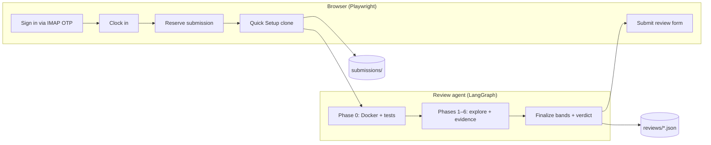

# >- shipd-agent

End-to-end autonomous reviewer for [Shipd.ai](https://shipd.ai) (Datacurve's Olympus/Mars quest workflow).

The agent signs in, clocks in, reserves a submission, clones it via Quick Setup, runs mechanical Phase 0 checks (Docker + `test.sh`), performs a rubric-aligned LLM review, and optionally submits structured feedback on Shipd — all without human intervention.

## Why this exists

Shipd's quality loop depends on **automated tests plus human review**. Reviewer throughput is the bottleneck. This agent mirrors a trained Shipd reviewer: same rubric (`shipd-rubric.md`), same band ratings, same contributor-facing feedback format — but runs continuously in batch mode with resume, cooldowns, and session accounting.

## Architecture



**Pipeline phases**

| Step | What happens |
|------|----------------|
| Auth | Headless Clerk login; OTP fetched over IMAP |
| Clock in | Starts Shipd time log for the quest |
| Reserve | Claims the next available submission |
| Clone | Runs Quick Setup script into `./submissions/` |
| Phase 0 | Builds Docker image, runs `test.sh` (base/new/solution) |
| Review | LangGraph agent explores repo, scores Problem/Tests/Solution bands 0–3 |
| Submit | Fills Shipd review form via Playwright (opt-in) |
| Cleanup | Removes clone + Docker artifacts (configurable) |
| Clock out | Posts per-quest session summary on batch completion |

## Install

**From source (recommended)**

```bash
git clone https://github.com/vaishcodescape/shipd-agent.git
cd shipd-agent
./run.sh --setup
cp .env.example .env   # AUTH_EMAIL, AUTH_PASSWORD, ANTHROPIC_API_KEY
./run.sh --check       # validate environment before first run
```

**From GitHub Releases** (install the published wheel)

```bash
pip install https://github.com/vaishcodescape/shipd-agent/releases/download/v0.1.0/shipd_agent-0.1.0-py3-none-any.whl
```

**From GitHub Packages** (if enabled for your org)

```bash
pip install shipd-agent \
  --index-url https://pypi.pkg.github.com/vaishcodescape/simple/
```

## Quick start

**Safe first run** — review locally, do not submit on Shipd:

```bash
./run.sh --once --no-submit
```

**Full cycle** — review and submit one submission:

```bash
./run.sh --once --submit
```

**Overnight batch** — 10 reviews, cooldown every 5 completed:

```bash
./run.sh --reviews 10 --submit
```

**Monitor progress**

```bash
./run.sh --status
```

Submit is **off by default**. Pass `--submit` explicitly when you want feedback posted to Shipd.

## Test Demo  

For a live walkthrough without posting to Shipd:

```bash
./run.sh --check
./run.sh --once --no-submit --headed    # visible browser; review only
./run.sh --status
```

Inspect the generated review bundle under `reviews/` before enabling `--submit`.

## Quality controls

- **Rubric-aligned**: 7 phases (0–6), band ratings, severity-tagged findings, contributor feedback without internal jargon
- **Evidence-bound**: every claim must cite `file:line`, test output, or Phase 0 logs — no fabrication
- **Deterministic gates**: LOC thresholds, patch-apply checks, Docker test contract before LLM explore
- **Coverage recheck**: re-prompts the agent when required rubric phases lack evidence
- **Human-readable output**: review bundles saved to `reviews/` for audit before submit

## Requirements

- Python 3.14+
- Playwright Chromium (`./run.sh --setup`)
- Docker  
- IMAP app password for headless Shipd login
- Any LLM of your choice API key for the review agent

See `.env.example` for model selection, token budgets, cooldowns, and cleanup options.

## CLI reference

```bash
./run.sh --help          # full option list
./run.sh --version       # installed version
./run.sh --check         # environment doctor
./run.sh --status        # session stats + batch resume state
```

## Releases

Tagged releases and wheels: [github.com/vaishcodescape/shipd-agent/releases](https://github.com/vaishcodescape/shipd-agent/releases)

GitHub Package: [github.com/vaishcodescape/shipd-agent/packages](https://github.com/vaishcodescape/shipd-agent/packages)
